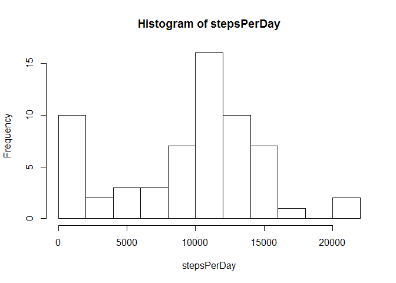
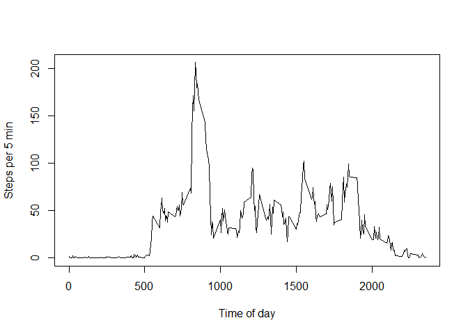
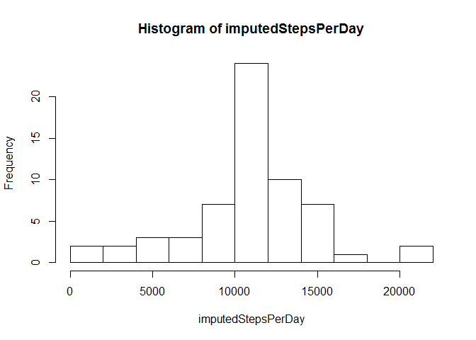
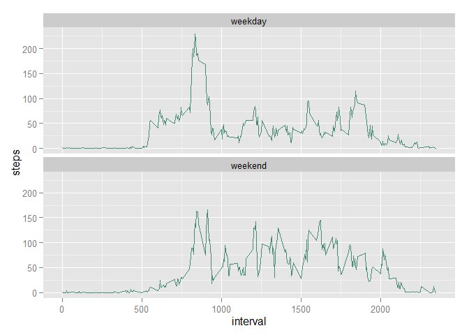

# Reproducible Research: Peer Assessment 1


## Loading and preprocessing the data


```r
activity<-read.csv(file = 'activity.csv')
```


## What is mean total number of steps taken per day?

We calculate the sum of steps per day and present the distribution using a histogram:

```r
stepsPerDay<-tapply(activity$steps,activity$date,sum, na.rm=TRUE)
hist(stepsPerDay,breaks = 10)
```

 
  
The mean amount of steps taken per day (omitting the NA values):

```r
mean(stepsPerDay)
```

```
## [1] 9354.23
```
The median amount of steps taken per day (omitting the NA values):

```r
median(stepsPerDay)
```

```
## [1] 10395
```

## What is the average daily activity pattern?
We calculate the average amount of steps taken per 5 minute interval and present the distribution using a time-series plot (note that format for intervals is 24h with omitted colon, e.g. 830 means 8:30AM):

```r
stepsPerInterval<-tapply(activity$steps,activity$interval,mean,na.rm=TRUE)
plot(stepsPerInterval,type = 'l',x = names(stepsPerInterval),xlab = 'Time of day', ylab = 'Steps per 5 min')
```

 
  
The interval with the maximum number of steps on average:

```r
names(which.max(stepsPerInterval))
```

```
## [1] "835"
```


## Imputing missing values
The total number of missing values is:

```r
nrow(activity[is.na(activity$steps),])
```

```
## [1] 2304
```

We create a copy of our original dataframe and then loop over every entry. If the number of steps is NA, then we replace it with a rounded average for this interval.

```r
imputedActivity <- activity

for (i in 1:nrow(imputedActivity)){
  if(is.na(imputedActivity$steps[i])){
    imputedActivity$steps[i] <- round(stepsPerInterval[as.character(imputedActivity$interval[i])])
  }
}
```
We calculate the new sum of steps per day (with imputed NA values) and present the distribution using a histogram:

```r
imputedStepsPerDay<-tapply(imputedActivity$steps,imputedActivity$date,sum)
hist(imputedStepsPerDay,breaks = 10)
```

 
  
The mean amount of steps taken per day (with imputed NA values):

```r
mean(imputedStepsPerDay)
```

```
## [1] 10765.64
```
The median amount of steps taken per day (with imputed NA values):

```r
median(imputedStepsPerDay)
```

```
## [1] 10762
```
**Main observations:**  
1. median and mean for the imputed data are larger than the same statistics for the initial data. This is because NAs were treated as zeroes, when we were summing up the initial dataset. Now all these imputes values are >= 0.  
2. median and mean for the imputed data are much more similar than the same statistics for the initial data. This is because the mean of the initial data is affected by the big amount of days with 0 steps, while the median is not affected that much.
  
## Are there differences in activity patterns between weekdays and weekends?
We use the function weekdays() to create a matrix of steps, where rows represent intervals and columns represent the type of the day (weekend or weekday)

```r
weekdays<-weekdays(as.POSIXlt.date(imputedActivity[,2]))
isWeekend<- weekdays=='Saturday' | weekdays=='Sunday'
imputedActivity$dayType <- as.factor(ifelse(isWeekend,'weekend','weekday'))
stepsPerIntervalAndDayType<-with(imputedActivity,tapply(steps,list(interval,dayType),mean))
```
Now we use the melt() function from reshape2 package to put the data into long format.

```r
library(reshape2)
melted<-melt(stepsPerIntervalAndDayType)
names(melted)<-c('interval','dayType','steps')
```
Finally, we create a ggplot based on the melted data. It is faceted by the day type.

```r
library(ggplot2)
ggplot(melted, aes(interval,steps))+geom_line(color="aquamarine4")+facet_wrap(~dayType, ncol=1)
```

 
  
**Main observations:**  
1. On weekdays there is a big peek in the morning, which is missing on weekends. Apparently, the person is working only on weekdays and all/part of the way to work is done by foot (and at the same time).  
2. On weekends there are more steps recorded during "business hours" if compared to the workdays. Apparently, the person is having a sedentiary workplace.
